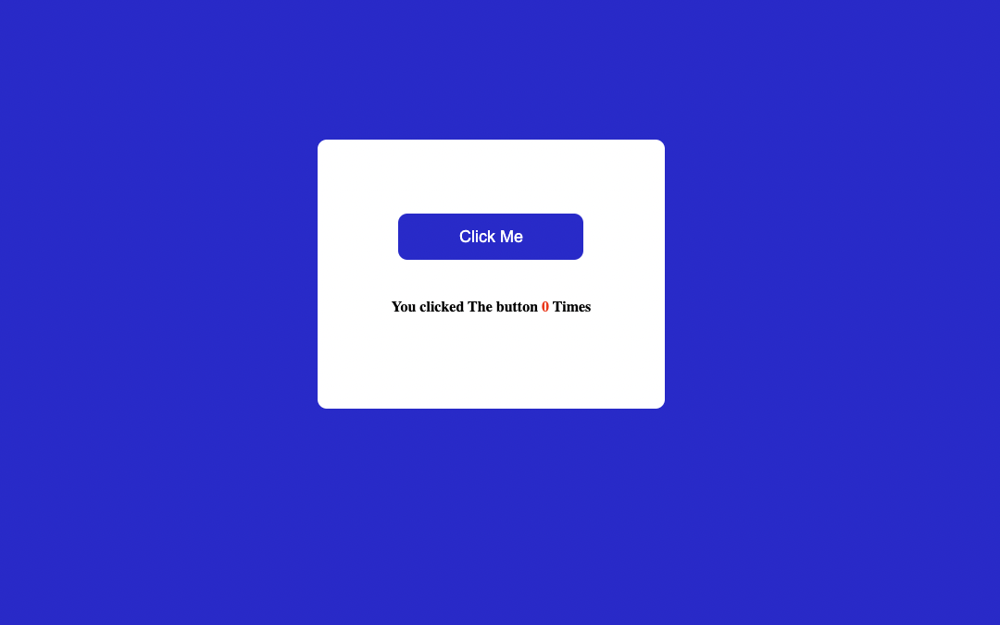

# ClickTheButton-JavaScript-Project

## About

This project is build using Javascript, on cliking the Button count will increase by 1 every time.

## ⚙️ What did I learn by making this project?

- using javaScript in html body.
- JavaScript DOM manuplialtion.
- learnt using function.

## ⌛ Time taken to finish this project?

This project took me around half an hour to finish.

## 📷 Screenshots

